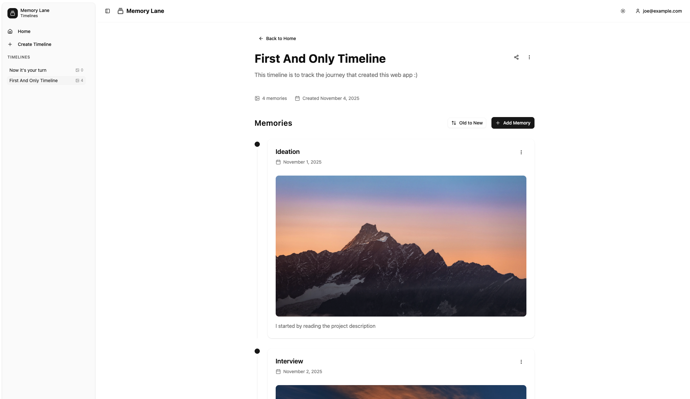

# Memory Lane

A beautiful, full-stack web application for creating and managing personal timelines and memories. Built with Next.js, TypeScript, tRPC, and Supabase.



## Features

✨ **Timeline Management**

- Create, edit, and delete personal timelines
- Automatic slug generation for shareable URLs
- Beautiful, chronological memory organization

📸 **Memory Cards**

- Upload and display images for each memory
- Add titles, descriptions, and dates
- Edit and delete memories with inline editing
- Sort memories chronologically (old-to-new or new-to-old)

🔐 **Authentication**

- Simple authentication system using Supabase Auth
- Protected routes for authenticated users
- Public timeline viewing for non-authenticated users

🎨 **Modern UI/UX**

- Responsive design with mobile-first approach
- Dark/light theme support
- Smooth animations and transitions
- Accessible interface (WCAG 2.1 AA compliant)
- Beautiful glassmorphism effects

⚡ **Performance**

- Optimized database queries (no N+1 problems)
- React.memo for expensive components
- Image optimization with Next.js Image
- Code splitting for faster load times

## Tech Stack

### Frontend

- **Next.js 16** (Pages Router) - React framework
- **TypeScript** - Type-safe development
- **React 19** - UI library
- **Tailwind CSS 4** - Utility-first CSS
- **shadcn/ui** - Beautiful, accessible components
- **Lucide React** - Icon library
- **Sonner** - Toast notifications

### Backend

- **tRPC** - End-to-end typesafe APIs
- **Supabase** - PostgreSQL database & authentication
- **Zod** - Schema validation
- **TanStack Query** - Data fetching & caching

### Development

- **ESLint** - Code linting
- **Prettier** (via Tailwind) - Code formatting

## Project Structure

```
memory-lane/
├── src/
│   ├── components/          # React components
│   │   ├── layout/          # Layout components (navbar, footer, sidebar)
│   │   ├── memory/          # Memory-related components
│   │   ├── timeline/        # Timeline-related components
│   │   ├── auth/            # Authentication components
│   │   ├── shared/          # Shared/reusable components
│   │   └── ui/              # UI primitives (shadcn/ui)
│   ├── contexts/            # React contexts (auth, theme)
│   ├── hooks/               # Custom React hooks
│   ├── lib/                 # Utility functions
│   ├── pages/               # Next.js pages
│   │   ├── api/             # API routes
│   │   ├── timeline/        # Timeline pages
│   │   └── login/           # Login page
│   ├── server/              # Server-side code
│   │   ├── routers/         # tRPC routers
│   │   └── services/        # Business logic services
│   ├── supabase/            # Supabase configuration
│   └── types/               # TypeScript type definitions
├── public/                  # Static assets
└── instructions/            # Project requirements
```

## Getting Started

### Prerequisites

- Node.js 18+ installed
- A Supabase account and project
- npm or pnpm package manager

### Installation

1. Clone the repository:

```bash
git clone <repository-url>
cd memory-lane
```

2. Install dependencies:

```bash
npm install
```

3. Set up environment variables:

Create a `.env` file in the root directory:

```env
NEXT_PUBLIC_SUPABASE_URL=your_supabase_url
NEXT_PUBLIC_SUPABASE_ANON_KEY=your_supabase_anon_key
```

You can also just copy the `.env.example` file and rename it to `.env`.

4. Set up the database (if using a different Supabase project):

Run the SQL schema in your Supabase project:

```bash
# The schema is located in src/supabase/schema.sql
```

5. Start the development server:

```bash
npm run dev
```

Visit [http://localhost:3000](http://localhost:3000) to see the app.

### Database Setup

The application uses Supabase PostgreSQL with the following tables:

- **timeline** - Stores timeline information
- **memory** - Stores individual memories with images

The schema includes:

- Row Level Security (RLS) policies
- Foreign key constraints
- Indexes for performance
- Storage bucket for images

See `src/supabase/schema.sql` for the complete schema.

## Development

### Available Scripts

```bash
npm run dev      # Start development server
npm run build    # Build for production
npm start        # Start production server
npm run lint     # Run ESLint
```

### Key Features Implementation

#### Authentication Flow

- Supabase Auth handles user authentication
- Protected routes check for valid sessions
- Public routes allow viewing without authentication

#### Data Fetching

- tRPC provides type-safe API calls
- TanStack Query handles caching and mutations
- Optimistic updates for better UX

#### Image Uploads

- Images uploaded to Supabase Storage
- Progress tracking during upload
- Automatic cleanup on delete

#### State Management

- React Context for global state (auth, theme)
- TanStack Query for server state
- Local component state for UI

#### Security

- Row Level Security (RLS) policies for the database. This way supabase creds can be used on client side without risking data injection from non-authenticated users.
- Only authenticated users can create, edit, and delete timelines and memories
- Public routes are allowed for non-authenticated users
- Protected routes are only accessible to authenticated users

#### Performance

- Optimized database queries
- React.memo for expensive components
- Image optimization with Next.js Image
- Code splitting for faster load times (only the pages that are needed are loaded)

## Architecture

See [ARCHITECTURE.md](./ARCHITECTURE.md) for detailed architecture documentation.

## Deployment

### Vercel (Recommended)

1. Push your code to GitHub
2. Import project in Vercel
3. Add environment variables
4. Deploy!

### Other Platforms

The app can be deployed to any platform supporting Next.js:

- Netlify
- AWS Amplify
- Railway
- Render

Make sure to:

1. Set environment variables
2. Configure build command: `npm run build`
3. Set output directory to `.next`

## Contributing

This is a personal project, but suggestions and feedback are welcome!

## License

MIT License - feel free to use this project as a reference or starting point for your own applications.

## Acknowledgments

- Built as part of a coding challenge
- UI components from [shadcn/ui](https://ui.shadcn.com/)
- Icons from [Lucide](https://lucide.dev/)
